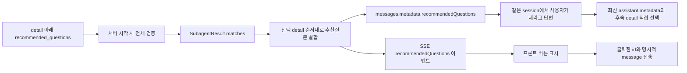

# 세부 시나리오별 추천질문 커스터마이징 가이드

## 1. 구현 결과 요약

추천질문은 AI가 생성하지 않는다. 활성 서브에이전트 manifest에 사람이 직접 작성한 문자열만 사용하며, 추천질문이 필요 없는 detail은 필드를 생략하거나 빈 배열로 둘 수 있다.

전체 흐름은 다음과 같다.



핵심 위치는 다음과 같다.

| 목적 | 수정/확인 위치 |
|---|---|
| PERFORMANCE_FEE 추천질문 문구 | [`prompts/subagents/performance-fee/v1/manifest.yaml`](../prompts/subagents/performance-fee/v1/manifest.yaml) |
| RP 추천질문 문구 | [`prompts/subagents/rp/v1/manifest.yaml`](../prompts/subagents/rp/v1/manifest.yaml) |
| QUALIFICATION 추천질문 문구 | [`prompts/subagents/qualification/v1/manifest.yaml`](../prompts/subagents/qualification/v1/manifest.yaml) |
| 로딩·누락·타입 검증, 이벤트 객체 조립 | [`app/recommended_questions.py`](../app/recommended_questions.py) |
| SSE 전송, messages metadata, 이력 저장 | [`app/api.py`](../app/api.py) |
| 상세 테스트 화면의 이벤트 처리·버튼 클릭 | [`static/intent_tester.html`](../static/intent_tester.html) |
| 간단 채팅 화면의 추천질문 버튼 | [`static/chatting.html`](../static/chatting.html) |

## 2. 추천질문을 수정하는 정확한 방법

추천질문이 필요한 세부 시나리오는 `description` 바로 아래 `recommended_questions` 배열을 작성한다.

```yaml
- code: "FEE_ITEM_DETAILS"
  name: "항목별 수수료 조회"
  description: "카드 모집인 본인에게 실제 지급된 항목별 수수료 조회"
  recommended_questions:
    - "세금과 최종 실지급액도 알려줘"
    - "최근 12개월 수수료 추이를 보여줘"
```

표시 순서는 YAML에 작성한 순서와 같다. 질문 개수에는 상한이 없다.

```yaml
recommended_questions:
  - "첫 번째 질문"
```

위처럼 한 개만 둘 수 있고, 다음처럼 필요한 만큼 추가할 수도 있다.

```yaml
recommended_questions:
  - "첫 번째 질문"
  - "두 번째 질문"
  - "세 번째 질문"
  - "네 번째 질문"
  - "다섯 번째 질문"
  # 이후에도 개수 제한 없이 추가 가능
```

추천질문이 필요 없으면 다음 두 형식이 모두 유효하다.

```yaml
- code: "DETAIL_WITHOUT_RECOMMENDATIONS"
  name: "추천질문 없는 업무"
  description: "이 detail은 답변만 보내고 추천질문 버튼을 만들지 않음"
```

```yaml
recommended_questions: []
```

추천질문에 사용자가 `네`라고 답했을 때 특정 후속 detail로 연결하려면 문자열
대신 다음 객체 형식을 사용한다.

```yaml
recommended_questions:
  - question: "팩스로 전송해드릴까요?"
    affirmative_followup:
      message: "원천징수 내역 팩스 전송을 승인했으니 팩스번호 입력을 진행해줘"
      detail_scenario_code: "WITHHOLDING_TAX_FAX_SEND"
```

- `question`: 프론트에 실제 표시되는 추천질문
- `affirmative_followup.message`: `네`를 대신해 대화이력과 후속 실행에 저장할
  완전한 사용자 요청. 업무 대상과 승인 의미가 모두 들어가야 한다.
- `affirmative_followup.detail_scenario_code`: 같은 agent의 manifest에 실제 존재하는
  후속 detail 코드. 이 값으로 후속 서브 시나리오를 LLM 추측 없이 직접 선택한다.

일반 조회형 추천질문에는 `affirmative_followup`을 작성하지 않는다. 이 설정은
질문 자체를 다시 보내는 것과 달리 `네`가 어떤 업무 승인인지 확정해야 할 때만
사용한다.

적용 절차는 다음과 같다.

1. 해당 agent의 `active.yaml`에서 현재 활성 버전을 확인한다.
2. 활성 버전의 `manifest.yaml`에서 대상 `detail.code`를 검색한다.
3. 그 detail의 `recommended_questions` 문자열 배열을 수정하거나, 추천질문이 필요 없으면 필드를 생략하거나 `[]`로 둔다.
4. 서버를 재시작한다. 설정은 서버 시작 시 한 번 로드한다.
5. 대상 질문을 호출하고 `recommendedQuestions` SSE 이벤트의 `detailScenarioCode`와 문구를 확인한다.

운영에서 버전 디렉터리를 새로 만드는 방식이라면 기존 `v1`을 직접 수정하지 말고 `v2` 등을 복사해 변경한 뒤 해당 agent의 `active.yaml`을 새 버전으로 전환한다.

## 3. 시작 시 검증 규칙

[`RecommendedQuestionRegistry.from_bundles()`](../app/recommended_questions.py)는 활성화된 모든 agent와 모든 detail을 순회한다. 추천질문 설정 오류가 전체 채팅 서버의 시작이나 답변 출력을 막지 않도록 다음처럼 방어적으로 처리한다.

- 필드 누락, `null`, 빈 배열: 추천질문 없음
- 단일 문자열: 질문 한 개짜리 배열로 자동 변환
- `{question: "..."}` 객체가 배열 안에 있음: `question` 문자열 사용
- 올바른 `affirmative_followup` 객체: 후속 message와 같은 agent의 detail 코드를
  함께 저장
- 후속 message가 비었거나 detail 코드가 존재하지 않음: 추천질문 문구는 유지하고
  긍정 후속 설정만 무시한 뒤 warning 기록
- 다른 타입, 빈 문자열, 올바르지 않은 객체: 해당 항목만 무시하고 서버 warning 로그 기록
- 같은 detail의 중복 문구: 첫 항목만 유지하고 이후 중복 무시
- 전체 필드가 배열/문자열이 아닌 객체 등: 해당 detail의 추천질문 전체를 무시

질문 개수는 0개 이상이며 최대 개수 검증이나 잘라내기 로직은 없다. 새 세부 시나리오를 추가할 때 추천질문이 필요 없다면 `recommended_questions`를 등록하지 않아도 된다.

## 4. 어떤 추천질문이 선택되는가

서브에이전트 출력 [`SubagentResult.matches`](../app/subagents/models.py)는 한 질문에서 선택된 세부 시나리오 배열이다. registry는 다음 순서를 그대로 유지한다.

1. `matches[0]`, `matches[1]` 순서
2. 각 detail의 `recommended_questions[0]`, `[1]` 순서

예를 들어 한 질문이 `PERFORMANCE_SUMMARY_TOTAL`과 `FEE_ITEM_DETAILS` 두 detail에 매칭되고 각 detail에 질문이 2개씩 있으면 총 4개가 전송된다. 다중 매칭에서도 전체 개수를 임의로 제한하거나 잘라내지 않는다.

추천질문은 조회 결과 값이나 답변 텍스트에서 생성하지 않는다. 선택된 `agent_code + detail_scenario_code`만 manifest 키로 사용한다. 따라서 LLM 답변이 같은 내용이어도 detail이 다르면 서로 다른 추천질문을 보낼 수 있다.

## 5. SSE 출력 계약

정상 `PASS` 답변에 추천질문이 1개 이상 있으면 token 전송이 끝난 뒤 이벤트 순서는 다음과 같다.

```text
messages                 # 완성된 assistant 답변과 metadata
recommendedQuestions     # 추천질문 배열
duration
end
```

추천질문이 0개면 `recommendedQuestions` 프레임만 빠져 `messages → duration → end` 순서가 된다. `messages`의 assistant metadata에는 이 경우에도 `recommendedQuestions: []`가 들어간다.

실제 SSE envelope 예시는 다음과 같다.

```text
data: {"event":"recommendedQuestions","data":[{"id":"PERFORMANCE_FEE:FEE_ITEM_DETAILS:1","question":"세금과 최종 실지급액도 알려줘","agentCode":"PERFORMANCE_FEE","promptVersion":"v1","scenarioCode":"FEE_DETAILS","detailScenarioCode":"FEE_ITEM_DETAILS"}]}

```

`data`는 배열이며 길이에 제한이 없다. 각 항목은 다음 의미를 가진다.

| 필드 | 의미 | 프론트 사용 권장 |
|---|---|---|
| `id` | `agent:detail:배열순번` 형태의 안정적인 렌더링 키 | 버튼 key |
| `question` | 사용자가 직접 관리한 문장 | 버튼 라벨 |
| `interactionType` | `prompt` 또는 `confirmation` | 클릭 전송 방식 선택 |
| `agentCode` | 추천질문의 소유 agent | 추적/로그 |
| `promptVersion` | 해당 subagent 활성 버전 | 버전 추적 |
| `scenarioCode` | 상위 시나리오 코드 | 분석/추적 |
| `detailScenarioCode` | 추천질문을 선택하게 만든 세부 시나리오 | 분석/추적 |
| `affirmativeFollowup` | 승인 클릭/`네`에 사용할 후속 message, agent, detail | confirmation 클릭 message |

추천질문은 `messages` 이벤트의 assistant metadata에도 같은 배열로 들어간다.

```json
{
  "role": "assistant",
  "content": "답변 본문",
  "metadata": {
    "renderables": [],
    "recommendedQuestions": [
      {
        "id": "PERFORMANCE_FEE:WITHHOLDING_TAX:1",
        "question": "팩스로 전송해드릴까요?",
        "agentCode": "PERFORMANCE_FEE",
        "promptVersion": "v1",
        "scenarioCode": "FEE_DETAILS",
        "detailScenarioCode": "WITHHOLDING_TAX",
        "affirmativeFollowup": {
          "message": "원천징수 내역 팩스 전송을 승인했으니 팩스번호 입력을 진행해줘",
          "agentCode": "PERFORMANCE_FEE",
          "detailScenarioCode": "WITHHOLDING_TAX_FAX_SEND"
        }
      }
    ]
  }
}
```

별도 이벤트는 실시간 UI 갱신에 사용하고, metadata는 대화이력 재조회 후 기존 답변 아래 추천질문을 복원할 때 사용한다. assistant 이력 저장 위치에서도 `renderables`와 함께 같은 metadata를 저장한다.

`INPUT_REQUIRED`와 일반 처리 오류에는 추천질문 이벤트를 보내지 않는다. 다만 실행
제안이 여러 개인데 사용자가 대상 없이 `네`라고 입력한 재선택 응답은 실행을
막은 `EXCEPTION` 상태여도 해당 confirmation 버튼을 다시 보낸다. 정상 답변이라도
선택된 모든 detail의 추천질문이 0개면 별도 이벤트를 생략하고 assistant metadata에는
빈 배열을 넣는다.

## 6. 프론트 구현 방법

SSE 수신기는 `recommendedQuestions` 이벤트의 `data` 배열을 현재 assistant 답변 상태에 저장한다.

```javascript
if (envelope.event === "recommendedQuestions") {
  currentAnswer.recommendedQuestions = Array.isArray(envelope.data)
    ? envelope.data
    : [];
}
```

버튼 라벨은 항상 `item.question`이다. `prompt` 버튼은 그 문장을 보내고,
`confirmation` 버튼은 `affirmativeFollowup.message`와 `item.id`를 함께 보낸다.
HTML 문자열에 직접 삽입하는 경우 반드시 escape하고, 가능하면 `textContent`를
사용한다.

```javascript
for (const item of currentAnswer.recommendedQuestions) {
  const button = document.createElement("button");
  button.type = "button";
  const isConfirmation = item.interactionType === "confirmation";
  button.textContent = isConfirmation ? `진행 · ${item.question}` : item.question;
  button.addEventListener("click", () => {
    sendChat({
      message: isConfirmation
        ? item.affirmativeFollowup.message
        : item.question,
      session_id: currentSessionId,
      thread_id: null,
      endpoint: currentEndpoint,
      agent_code: currentAgentCode,
      recommendation_id: isConfirmation ? item.id : null,
      humanInput: [],
      user: currentUser,
    });
  });
}
```

클릭 후 요청의 중요 규칙은 다음과 같다.

- `message`: prompt는 `question`, confirmation은 `affirmativeFollowup.message`
- `recommendation_id`: confirmation은 `id`, 일반 prompt는 null
- `session_id`: 기존 대화를 이어 가도록 현재 session 유지
- `thread_id`: 일반 후속 질문이므로 `null`; 이전 HITL thread를 재사용하지 않음
- `humanInput`: 일반 질문이므로 빈 배열
- `agent_code`: 현재 프론트의 agent 선택 정책을 그대로 적용

추천질문이 단순 조회가 아니라 독립 실행 detail을 시작할 수도 있다. 현재 `WITHHOLDING_TAX`의 `"팩스로 전송해드릴까요?"`를 클릭하면 `WITHHOLDING_TAX_FAX_SEND`가 직접 선택되고 Python 팩스번호 action이 발생한다. 추천질문 클릭 시에는 `thread_id=null`이고, action을 받은 다음부터 동일 `thread_id`를 유지해야 한다. 전체 계약은 [`10_MULTI_STEP_ACTION_AND_MCP_WORKFLOW.md`](10_MULTI_STEP_ACTION_AND_MCP_WORKFLOW.md)를 참고한다.

중복 클릭을 막기 위해 새 응답을 받는 동안 추천질문 버튼과 일반 전송 버튼을 함께 비활성화하는 것을 권장한다.

### 6.1 버튼을 누르지 않고 `네`라고 답하는 경우

이 경우 추천질문 문장이 user 메시지 본문으로 저장되는 것이 아니라, 직전 assistant
메시지의 `metadata.recommendedQuestions`에 저장되어 있어야 한다. 서버는 새 요청을
분류하기 전에 같은 `employee_id + session_id + agent_code` 이력을 metadata 포함으로
읽고 다음 조건을 모두 만족할 때만 자동 연결한다.

1. 현재 이력의 마지막 항목이 assistant다.
2. 그 assistant의 추천질문 중 `affirmativeFollowup`이 설정된 항목이 정확히 하나다.
3. 현재 message 전체가 `네`, `예`, `응`, `좋아요`, `진행해 주세요`, `해주세요`,
   `OK`, `yes` 등 보수적으로 등록된 명시적 긍정 표현과 일치한다. 공백과 일반
   문장부호는 무시한다.

조건이 맞으면 마스터 LLM과 서브 LLM을 호출하지 않고 metadata의 agent/detail을
직접 선택한다. 팩스 예에서는 추천질문에 대한 긍정 자체가 독립 팩스 detail 선택
근거이므로 승인 parameter를 만들지 않고 Python handler가 곧바로 팩스번호 action을
반환한다.

```json
{
  "message": "네",
  "session_id": "conversation-001",
  "thread_id": null,
  "endpoint": "acqsc",
  "agent_code": "PERFORMANCE_FEE",
  "recommendation_id": null,
  "humanInput": [],
  "user": {"id": "S123456", "deptcode": "D001", "deptname": "서울지점"}
}
```

`session_id`와 `user.id`는 원천징수 조회 응답을 받은 요청과 같아야 한다.
`thread_id`는 아직 action 재진입이 아닌 새 대화 메시지이므로 `null`,
`humanInput`은 빈 배열이다. 이력이 만료·저장 실패했거나 최신 assistant에 후속
후보가 없으면 일반 의도분류로 진행한다. 후보가 둘 이상이면 LLM과 MCP를 호출하지
않고 “아래 항목 중 하나를 선택해 달라”는 고정 안내와 실행 가능한 버튼만 다시
보낸다. 사용자가 버튼을 고르면 `recommendation_id`로 정확히 연결한다. `아니요`,
`취소`, 설명이 섞인 애매한 문장은 자동 승인하지 않는다.

마스터 LLM에 전달하는 일반 이력에도 assistant 본문 다음 줄에 추천질문 문구가
포함된다. 따라서 자동 연결 대상이 아닌 자연스러운 후속 표현도 문맥을 볼 수
있지만, 실제 업무를 즉시 실행하는 확정 경로는 위의 보수적인 규칙만 사용한다.

## 7. `/chat` SSE 추천질문

간단 채팅 화면과 진단 화면은 모두 `/chat` SSE의 `recommendedQuestions` 이벤트와
완성 `messages[].metadata.recommendedQuestions`를 사용한다. 과거 비스트리밍
`{code,data.text}` 응답은 제거했다. [`static/chatting.html`](../static/chatting.html)은
질문 버튼을 답변 말풍선 아래 표시하고 클릭하면 같은 session으로 재전송한다.

## 8. Postman/curl 확인 포인트

Postman에서 `POST /chat`, `Accept: text/event-stream`, `Authorization: Bearer test-token`, `Content-Type: application/json`을 설정하고 스트림 요청 형식을 전송한다.

응답 본문에서 다음 문자열을 검색한다.

```text
"event":"recommendedQuestions"
```

확인 항목은 다음과 같다.

1. `messages` 완성 이벤트 다음에 추천질문 이벤트가 오는가
2. 선택된 detail과 `detailScenarioCode`가 같은가
3. YAML 배열 순서와 이벤트 배열 순서가 같은가
4. 다중 detail 질문에서 각 detail의 추천질문이 모두 합쳐지는가
5. 대화이력 조회 시 assistant `metadata.recommendedQuestions`가 남아 있는가
6. 버튼 클릭 요청이 기존 session, 새 일반 질문 형식으로 전송되는가
7. 같은 session에서 `message="네"`, `thread_id=null`, `humanInput=[]`를 보내면
   팩스 승인 action을 건너뛰고 `fax_number` action이 오는가
8. 실행 가능한 confirmation이 둘 이상일 때 `네`가 MCP를 실행하지 않고 선택
   안내와 버튼을 다시 보내는가
9. 다시 받은 버튼의 `id`를 `recommendation_id`로 보내면 선택한 detail만 실행되는가

## 9. 변경 시 추적 체크리스트

- 문구만 변경: 해당 detail의 `recommended_questions`만 수정
- 표시 순서 변경: YAML 배열 순서 변경
- 질문 추가/삭제: 배열 항목 추가/삭제. 0개가 되면 필드 삭제 또는 `[]` 사용
- 새 detail 추가: 추천질문은 선택사항. 필요한 경우에만 문자열 배열 등록
- 이벤트 이름 변경: `app/api.py`, 두 HTML 화면, 외부 프론트 수신기를 동시에 변경
- 객체 필드 변경: `RecommendedQuestionDefinition.to_event_item()`과 외부 프론트 타입을 동시에 변경
- confirmation 클릭 계약 변경: `recommendation_id`와 두 목업 화면의 전송 로직을 동시에 변경
- 이력 복원 정책 변경: SSE metadata와 `history_store.append_message()` metadata를 동시에 변경
- `네`로 연결할 후속 업무 변경: 해당 질문의 `affirmative_followup.message`와
  `detail_scenario_code`를 함께 변경
- 자동 승인 표현 변경: [`_AFFIRMATIVE_RESPONSES`](../app/recommended_questions.py)를
  변경하되 오탐으로 실제 MCP 업무가 실행될 수 있으므로 부분 문자열 매칭은 피함

이 구조에서 사람이 관리해야 하는 업무 문구는 manifest에만 있고, Python과 프론트는 시나리오 내용과 무관한 공통 로직만 가진다.
