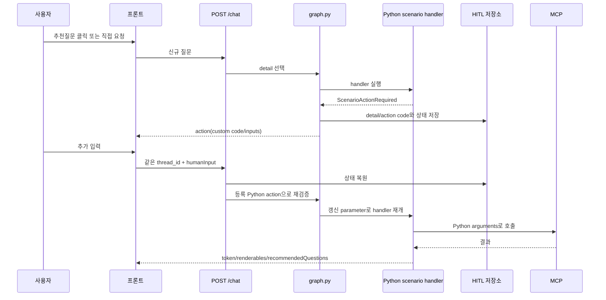

# 함수형 Action·MCP 상호작용 커스터마이징 가이드

## 1. 현재 원칙

활성 세부 시나리오의 action은 YAML `interaction`으로 제어하지 않는다.

- YAML: 시나리오 분류, detail parameter 목록, 추천질문과 후속 detail 연결
- Python action 함수: action code, 안내문, 입력 필드, 검증, 민감값, parameter 반영
- Python MCP handler: 도구명, arguments, 활성 여부, 반복·페이지·연계 호출
- Python output handler: 성공/실패 문구, 정제 데이터, table/card/file 출력

공통 실행 계약은 [`app/scenario_actions.py`](../app/scenario_actions.py), 실제 업무
정의는 [`app/mcp/scenarios`](../app/mcp/scenarios)에 있다. YAML의 `interaction` 모델과
payload 코드는 과거 선언형 시나리오 호환용일 뿐 현재 활성 업무의 기본 경로가 아니다.

MCP 결과가 비어 있거나 오류인 경우 action을 보내고, 입력을 받은 뒤 같은 handler를
재개하거나 다음 MCP를 호출하는 방법은
[`16_RESULT_DRIVEN_ACTION_RESUME.md`](16_RESULT_DRIVEN_ACTION_RESUME.md)를 함께 본다.



## 2. 원천징수 조회와 팩스 전송의 분리

두 업무는 서로 다른 detail이다.

| detail | 역할 | 직접 실행 결과 |
|---|---|---|
| `WITHHOLDING_TAX` | 원천징수 내역 조회 | 조회 MCP 결과와 표 |
| `WITHHOLDING_TAX_FAX_SEND` | 원천징수 내역 팩스 전송 | 팩스번호 action 후 전송 MCP |

`WITHHOLDING_TAX`에는 팩스번호나 승인 parameter가 없다. 조회 답변에 표시할
추천질문만 다음처럼 후속 detail을 가리킨다.

```yaml
recommended_questions:
  - question: "팩스로 전송해드릴까요?"
    affirmative_followup:
      message: "원천징수 내역 팩스 전송을 승인했으니 팩스번호 입력을 진행해줘"
      detail_scenario_code: "WITHHOLDING_TAX_FAX_SEND"
```

추천질문 버튼 클릭 또는 직전 답변 뒤 자연어 `네`는
`WITHHOLDING_TAX_FAX_SEND`를 직접 선택한다. 추천질문 선택 자체가 전송 의사
표시이므로 `fax_confirmation`이나 별도 `signal=OK` action은 사용하지 않는다.

직접 “원천징수 내역을 팩스로 보내줘”라고 입력해도 subagent가 같은 독립 detail을
선택한다. 팩스번호가 질문에 포함되어 있으면 바로 검증하고, 없거나 잘못되었으면
Python 팩스번호 action을 보낸다.

## 3. 원천징수 팩스 action을 수정하는 곳

파일: [`app/mcp/scenarios/performance_fee.py`](../app/mcp/scenarios/performance_fee.py)

### 3.1 action code·안내문·입력 형식

[`_withholding_tax_fax_number_action()`](../app/mcp/scenarios/performance_fee.py)을
수정한다.

```python
def _withholding_tax_fax_number_action() -> ScenarioActionDefinition:
    return ScenarioActionDefinition(
        agent_code="PERFORMANCE_FEE",
        detail_scenario_code="WITHHOLDING_TAX_FAX_SEND",
        action_code="WITHHOLDING_TAX_FAX_NUMBER_REQUIRED",
        message="원천징수 내역을 받을 팩스번호를 입력해 주세요.",
        inputs=(
            ScenarioActionInput(
                parameter_name="fax_number",
                input_code="fax_number",
                label="팩스번호",
                input_type="tel",
                pattern=r"^(?:0\d{1,2})-?\d{3,4}-?\d{4}$",
                min_length=9,
                max_length=13,
                validation_message="팩스번호 형식을 확인해 주세요.",
                sensitive=True,
            ),
        ),
    )
```

| Python 필드 | 프론트 출력/서버 역할 |
|---|---|
| `action_code` | SSE `action.data.code` |
| `message` | SSE `action.data.message` |
| `parameter_name` | 검증 완료 후 subagent parameter에 저장할 키 |
| `input_code` | `inputs[].code`, 다음 요청의 `humanInput[].code` |
| `label`, `input_type` | 프론트 폼 표시 |
| `pattern`, 길이, 허용값 | 최초 LLM 추출값과 action 재진입값을 모두 검증 |
| `validation_message` | `errors[input_code]` |
| `sensitive` | subagent log, CSV, output 추적 parameter 마스킹 |
| `value_parser` | 표준 검증 대신 실행할 사용자 정의 Python 함수 |

### 3.2 실제 MCP 이름·arguments·활성 여부

같은 파일의 상수와
[`withholding_tax_fax_send()`](../app/mcp/scenarios/performance_fee.py)을 수정한다.

```python
WITHHOLDING_TAX_FAX_TOOL_ENABLED = False
WITHHOLDING_TAX_FAX_TOOL_NAME = "withholding_tax_fax_send"

async def withholding_tax_fax_send(context):
    action_values = WITHHOLDING_TAX_FAX_NUMBER_ACTION.require(
        context.subagent.parameters
    )
    return await context.call(
        step_code="WITHHOLDING_TAX_FAX_SEND",
        tool_name=WITHHOLDING_TAX_FAX_TOOL_NAME,
        arguments={
            "bearerToken": context.request_context.get("access_token"),
            "employeeId": context.employee_id,
            "faxNumber": action_values["fax_number"],
        },
        enabled=WITHHOLDING_TAX_FAX_TOOL_ENABLED,
    )
```

실제 MCP가 준비되면 상수를 `True`로 바꾸고 `tool_name`과 `arguments`만 실제
schema에 맞춘다. 공통 JSON-RPC envelope, Authorization, request ID, 응답 파싱은
`ScenarioMcpHandlerContext.call()` 아래 공통 실행기가 담당한다.

### 3.3 성공·미연결·실패 출력

[`withholding_tax_fax_send_output()`](../app/mcp/scenarios/performance_fee.py)을 수정한다.
현재는 `backend == "disabled"`, 성공, 실패를 구분하며 미연결 상태를 성공 문구로
잘못 표시하지 않는다.

## 4. 프론트 요청 예시

팩스 추천질문을 누를 때는 새 업무이므로 `thread_id`를 비우고, 가능하면
추천질문 이벤트의 `id`를 `recommendation_id`로 돌려준다.

```json
{
  "message": "팩스로 전송해드릴까요?",
  "session_id": "conversation-001",
  "thread_id": null,
  "endpoint": "acqsc",
  "agent_code": "PERFORMANCE_FEE",
  "recommendation_id": "PERFORMANCE_FEE:WITHHOLDING_TAX:1",
  "humanInput": [],
  "user": {"id": "S123456"}
}
```

첫 응답 action은 승인 action이 아니라 바로 팩스번호 입력이다.

```json
{
  "code": "WITHHOLDING_TAX_FAX_NUMBER_REQUIRED",
  "thread_id": "server-generated-thread-id",
  "message": "원천징수 내역을 받을 팩스번호를 입력해 주세요.",
  "inputs": [
    {
      "code": "fax_number",
      "label": "팩스번호",
      "type": "tel",
      "required": true,
      "sensitive": true
    }
  ]
}
```

재진입은 action의 동일한 `thread_id`를 사용한다.

```json
{
  "message": "팩스번호를 입력합니다.",
  "session_id": "conversation-001",
  "thread_id": "server-generated-thread-id",
  "endpoint": "acqsc",
  "agent_code": "PERFORMANCE_FEE",
  "humanInput": [
    {"code": "fax_number", "input": "02-1234-5678"}
  ],
  "user": {"id": "S123456"}
}
```

## 5. 새 action을 추가하는 방법

### 5.1 action 한 개

1. 세부 시나리오 Python 파일에 정의를 반환하는 함수를 작성한다.
2. `register_scenario_action()`으로 등록한다.
3. MCP handler에서 `ACTION.require(context.subagent.parameters)`를 호출한다.
4. 반환된 정규화 값을 MCP arguments에 사용한다.

```python
def _customer_number_action():
    return ScenarioActionDefinition(
        agent_code="SAMPLE",
        detail_scenario_code="AUTO_PAYMENT_CONNECT",
        action_code="CUSTOMER_NUMBER_REQUIRED",
        message="고객번호를 입력해 주세요.",
        inputs=(
            ScenarioActionInput(
                parameter_name="customer_number",
                input_code="customer_number",
                label="고객번호",
                pattern=r"^[0-9]{10}$",
                sensitive=True,
            ),
        ),
    )

CUSTOMER_NUMBER_ACTION = register_scenario_action(_customer_number_action())
```

### 5.2 여러 필드를 한 action에서 받기

`inputs` tuple에 필드를 여러 개 넣으면 프론트 action 하나에 모두 전달된다.
재진입 검증이 모두 성공한 경우에만 각 `parameter_name`이 한 번에 반영된다.

### 5.3 action을 여러 단계로 이어가기

각 단계 정의를 따로 등록하고 handler에서 순서대로 `require()`를 호출한다.
첫 번째 값이 없으면 첫 action에서 중단되고, 재진입 후 handler가 다시 실행되면
첫 번째는 통과하고 두 번째 action이 발생한다.

```python
async def automatic_payment_connect(context):
    confirmation = CONFIRM_ACTION.require(context.subagent.parameters)
    customer = CUSTOMER_ACTION.require(context.subagent.parameters)
    payment = PAYMENT_DAY_ACTION.require(context.subagent.parameters)
    return await context.call(
        step_code="CONNECT",
        tool_name="automatic_payment_connect",
        arguments={
            "approved": confirmation["connection_confirmation"],
            "customerNo": customer["customer_number"],
            "paymentDay": payment["payment_day"],
        },
    )
```

action 단계 수는 YAML 배열이나 공통 runtime에 고정되지 않는다. 조건문, 이전 MCP
결과, 사용자 권한 등에 따라 어떤 `require()`를 호출할지도 handler 함수에서 직접
결정할 수 있다.

### 5.4 완전한 사용자 정의 파싱

`value_parser`는 `(저장할 문자열, 오류 또는 None)`을 반환한다.

```python
def parse_payment_day(raw):
    value = str(raw or "").strip().removesuffix("일")
    if value not in {"5", "10", "15", "20", "25"}:
        return value, "납부일은 5, 10, 15, 20, 25일 중 선택해 주세요."
    return value, None
```

이 함수는 질문에서 LLM이 추출한 값과 프론트 `humanInput` 모두에 동일하게 적용된다.

## 6. 추천질문과 action의 경계

추천질문은 답변 뒤 사용자가 선택할 다음 업무이므로 YAML에 둘 수 있다. 추천질문의
`affirmative_followup.detail_scenario_code`는 독립 detail을 가리킬 뿐 action 필드나
MCP 실행 규칙을 포함하지 않는다.

- 추천문구·표시 순서·후속 detail: manifest `recommended_questions`
- `네` 판별과 최신 assistant metadata 확인: `app/recommended_questions.py`
- action 내용과 검증: 세부 시나리오 Python 파일
- action 재진입과 Redis 복원: `app/graph.py`

실행 가능한 추천질문이 여러 개인데 사용자가 ID 없이 `네`만 입력하면 서버는 임의로
최신 항목을 실행하지 않고 선택지를 다시 보낸다.

## 7. 프론트 구현 규칙

프론트는 action code별 폼을 하드코딩하지 않고 `inputs`를 순회하는 것이 기본이다.

```javascript
const humanInput = action.inputs.map((definition) => ({
  code: definition.code,
  input: definition.type === "hidden"
    ? definition.expectedValue
    : formValues[definition.code],
}));
```

- 신규 질문/추천질문: `thread_id=null`
- action 재진입: action이 준 동일 `thread_id`
- 새 action이 오면 이전 입력 UI를 교체
- `errors[input.code]`를 해당 필드 아래 표시
- 매 재진입 요청에 최신 Authorization과 request context를 다시 전송

## 8. 추적 위치

| 확인 대상 | 파일/함수 |
|---|---|
| 함수형 action 계약·등록·민감값 | [`app/scenario_actions.py`](../app/scenario_actions.py) |
| 팩스 action/MCP/output | [`app/mcp/scenarios/performance_fee.py`](../app/mcp/scenarios/performance_fee.py) |
| 아파트 주소 action/MCP/output | [`app/mcp/scenarios/rp.py`](../app/mcp/scenarios/rp.py) |
| detail → MCP handler 연결 | [`app/mcp/scenarios/registry.py`](../app/mcp/scenarios/registry.py) |
| action 생성·Redis 재진입·parameter 반영 | [`app/graph.py`](../app/graph.py) |
| 내부 action → SSE 외부 구조 | [`app/streaming.py`](../app/streaming.py) |
| 추천질문 및 자연어 `네` 연결 | [`app/recommended_questions.py`](../app/recommended_questions.py) |
| 개발 추적 화면 | [`static/intent_tester.html`](../static/intent_tester.html) |

tester의 action state/interrupt context에는 `scenario_action_code`, `handler_code`,
`code_location`, `action_source=python_scenario_handler`가 기록된다. 운영 프론트에는
내부 context를 노출하지 않고 action code/message/inputs/errors만 전달한다.

## 9. 검증 순서

1. 원천징수 조회 후 팩스 추천질문이 표시되는지 확인한다.
2. 추천질문 클릭 또는 직후 `네` 입력 시 독립 팩스 detail이 선택되는지 확인한다.
3. 첫 action code가 `WITHHOLDING_TAX_FAX_NUMBER_REQUIRED`인지 확인한다.
4. `123`을 보내 같은 action과 `errors.fax_number`가 오는지 확인한다.
5. `02-1234-5678`을 보내 현재는 MCP 미연결 문구로 정상 종료되는지 확인한다.
6. 실제 도구 연결 후 handler arguments와 output 함수를 실제 schema에 맞춘다.
7. 여러 action 업무는 각 재진입에서 같은 thread ID와 최신 access token이 유지되는지
   확인한다.
