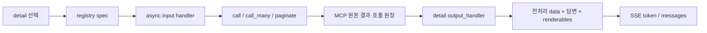

# 함수 중심 MCP 입력·결과 전처리 가이드

현재 MCP 커스터마이징의 기본 방식은 중앙 columns 설정이 아니라, detail별 Python
함수다. YAML은 의도 분류·파라미터·추천질문만 관리한다. action/HITL 입력 정의,
실제 MCP 흐름과 출력은 [`app/mcp/scenarios`](../app/mcp/scenarios) 아래 코드가 결정한다.

## 1. detail 하나에 연결되는 두 함수

각 `(agent_code, detail_scenario_code)`는
[`app/mcp/scenarios/registry.py`](../app/mcp/scenarios/registry.py)의 `_spec()`에서
다음 두 함수를 연결한다.

```python
("PERFORMANCE_FEE", "COMPOSITE_CONVERSION_EXCLUDED"): _spec(
    "performance_fee.composite_conversion_excluded.v1",
    performance_fee.composite_conversion_excluded,          # 입력·호출 흐름
    output_handler=performance_fee.composite_conversion_excluded_output,
    output_handler_code="performance_fee.composite_conversion_excluded_output.v1",
)
```

| 함수 | 자유롭게 정할 수 있는 범위 |
|---|---|
| async 입력 handler | tool name, arguments, 조건문, MCP 1~N회, fan-out, 다음 MCP 연결, pagination |
| `*_output()` 함수 | 원본 JSON 파싱, 컬럼·그리드 선택, 중복 병합, 집계, 답변 문장, table/card/file renderable |

공통 [`ScenarioMcpHandlerContext`](../app/mcp/scenario_runtime.py)는
`call/call_many/paginate` 실행·추적·인증·오류 안전성만 제공한다. 업무 결과 schema를
공통 runtime에 넣지 않는다.

## 2. 전체 흐름



[`app/mcp/result_adapters.py`](../app/mcp/result_adapters.py)는 중앙 컬럼 선택을 하지
않는다. 안전한 문맥을 만들고 output handler의 반환값을 `formatted_result`로
직렬화한다.

## 3. 입력과 여러 MCP 호출 구성

```python
async def example(context: ScenarioMcpHandlerContext) -> McpExecutionResult:
    first = await context.call(
        step_code="LIST",
        tool_name="list_tool",
        arguments={
            "employeeId": context.employee_id,
            "month": context.subagent.parameters.get("closing_year_month", ""),
            "accessToken": context.request_context.get("access_token", ""),
        },
    )
    if not first.succeeded:
        return first

    detail_arguments = []
    for item in extract_data_items(first.result):
        if item.get("objId") == "customerId":
            detail_arguments.append({"customerId": item.get("objVal")})

    return await context.call_many(
        step_code="DETAIL",
        tool_name="detail_tool",
        arguments_list=detail_arguments,
        error_policy="continue",
        max_items=1000,
    )
```

페이지 MCP는 도구별 callback을 해당 scenario 파일에 작성한다.

```python
return await context.paginate(
    step_code="PAGES",
    tool_name="list_tool",
    initial_arguments={"month": "202608"},
    next_arguments=build_next_arguments,
    max_pages=1000,
)
```

`build_next_arguments(page, page_number)`는 각 도구의 next key 종료 규칙과 다음
arguments를 직접 만든다. `nextkey` 전체가 비었을 때 종료하고 `gridct`를
`no1PgeSize`로 보내는 현재 예시는
[`_all_next_key_arguments()`](../app/mcp/scenarios/performance_fee.py)에 있다.

### 목록 조회 후 code별 페이지네이션

`PERFORMANCE_FEE / COMPOSITE_CONVERSION_SCORE`는 다음 순서로 실행한다.

1. `COMPOSITE_SCORE_PARAMETERS`에서 `test_tool`을 한 번 호출한다.
2. 결과의 `[{"code": "...", "code_name": "..."}]`를 추출한다.
3. 각 code마다 `COMPOSITE_SCORE_PAGES_0000` 형식의 독립 step을 만든다.
4. 각 step 안에서 nextkey가 끝날 때까지 `test_tool`을 페이지 조회한다.
5. output handler가 code별 `rawPages`와 평탄화한 `gridRows`를 그룹화한다.

개발 중 목록을 직접 넣으려면
[`COMPOSITE_SCORE_PARAMETER_OVERRIDE`](../app/mcp/scenarios/performance_fee.py)에
다음처럼 작성한다. 빈 tuple이면 실제 첫 MCP 결과를 사용한다.

```python
COMPOSITE_SCORE_PARAMETER_OVERRIDE = (
    {"code": "A", "code_name": "A 유형"},
    {"code": "B", "code_name": "B 유형"},
)
```

페이지 MCP에서 바뀌는 입력 필드명은 `composite_conversion_score()`의
`initial_arguments` 안 `"code": code`에서 수정한다. 최종 문장·표·업무 컬럼은
`composite_conversion_score_output()`만 수정하면 된다. 이 함수가 반환하는
`data.groups[].rawPages`에는 Postman/tester에서 확인할 페이지별 arguments와 MCP
원본 result가 그대로 들어간다.

## 4. output 함수가 받는 전체 데이터

```python
def example_output(context: ScenarioMcpOutputContext) -> ScenarioMcpOutput:
    ...
```

| 값 | 의미 |
|---|---|
| `context.raw_result` | terminal MCP 원본/집계 결과 전체 |
| `context.data_items()` | 일반 `data` 목록. 중복 objId도 제거하지 않고 유지 |
| `context.workflow_results` | 단건·페이지·fan-out·집계를 포함한 모든 `McpExecutionResult` |
| `context.results_for("STEP")` | 특정 다단계 step 결과만 선택 |
| `context.workflow` | `execution`, `batches`, `results`, `by_step`을 가진 안전한 실행 원장 |
| `context.parameters` | 현재 detail의 LLM/HITL 파라미터 |
| `context.request_context` | access token이 제거된 사용자·세션·조직 문맥 |

`data_items()`는 편의 함수다. MCP가 row/grid/중첩 JSON을 반환하면
`context.raw_result` 또는 `context.workflow["batches"]`를 직접 파싱하면 된다.
현재 `COMPOSITE_CONVERSION_EXCLUDED`는 모든 페이지의 `no1Grid.objVal`만 재귀적으로
평탄화하고, 반복되는 바깥 항목은 첫 페이지 값만 `commonItems`에 남긴다.

## 5. 중복 컬럼과 페이지 결과

`extract_value(data, "no1Grid")`는 첫 번째 값 하나만 꺼낸다. 조회 횟수가
동적이면 `occurrence`를 고정하지 말고 직접 수집한다.

```python
items = context.data_items()
all_grids = [
    item.get("objVal")
    for item in items
    if str(item.get("objId", "")).strip() == "no1Grid"
]

for item in items:
    if item.get("objId") != "no1Grid":
        continue
    page_number = int(item.get("_function_call", {}).get("index", 0)) + 1
    # 페이지별 grid를 원하는 row/card/chart로 전처리
```

정확한 페이지 수는 `context.workflow["execution"]["pageCount"]` 또는
`len(context.workflow["batches"])`다. `no1Grid` 개수는 페이지마다 하나일 때만
페이지 수와 같다.

## 6. 전처리 data·답변·테이블을 직접 반환

```python
def example_output(context: ScenarioMcpOutputContext) -> ScenarioMcpOutput:
    rows = []
    for item in context.data_items():
        if "nextkey" in str(item.get("objId", "")).casefold():
            continue
        rows.append((item.get("objNm", item.get("objId")), item.get("objVal")))

    return ScenarioMcpOutput(
        data={"rows": rows, "rawItemCount": len(context.data_items())},
        answer=ScenarioAnswer(
            text=f"[조회 결과]\n- {len(rows)}건을 조회했습니다.",
            renderables=[
                create_table_renderable(
                    code="result-table",
                    title="조회 결과",
                    format="markdown",
                    columns=("항목", "값"),
                    rows=rows,
                )
            ],
        ),
        metadata={"schema": "example.v1"},
    )
```

`ScenarioMcpOutput.data`에는 dict, list, 차트 series, 카드 배열 등 JSON 가능 구조를
자유롭게 넣는다. 답변 text는 token, renderables는 `messages` 이벤트로 전달되며
둘 다 OUTPUT 가드레일을 통과한다.

## 7. 새 detail 체크리스트

1. manifest에 분류용 detail·파라미터를 추가하고 필요한 action은 Python에 등록한다.
2. `app/mcp/scenarios/<agent>.py`에 async 입력 handler를 작성한다.
3. 같은 파일에 `*_output(context)` 함수로 실제 MCP 응답을 전처리한다.
4. registry `_spec()`에 handler와 `output_handler`를 모두 연결한다.
5. tests에 arguments, 호출 횟수, 페이지 종료, 전처리 data와 renderable을 검증한다.
6. `/mock/intent-tester`에서 handlerCode, raw result, outputHandlerCode,
   preprocessedData와 오류 코드를 확인한다.

## 8. 개발 추적에서 찾는 위치

| trace 값 | 수정할 함수 |
|---|---|
| `handlerCode` | 해당 async 입력 handler |
| `nextArgumentKeys` | 해당 handler가 넘긴 next-key callback |
| step raw result | 실제 MCP schema 파싱 대상 |
| `outputHandlerCode` | 같은 scenario 파일의 output 전처리 함수 |
| `preprocessedData` | `ScenarioMcpOutput.data` 생성 코드 |
| `formattedResult.renderables` | `ScenarioAnswer` 생성 코드 |

`MCP함수결과전처리완료` trace에서 원본 결과와 전처리 결과를 함께 확인할 수 있다.
