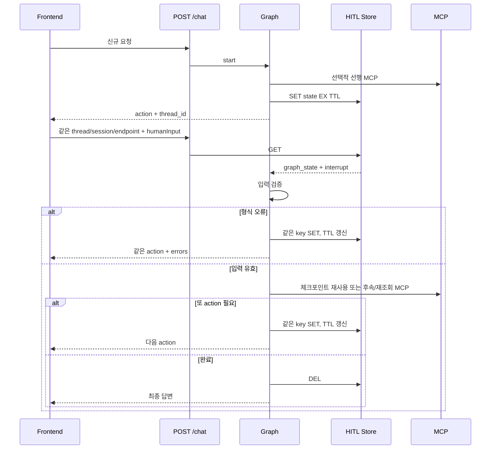

# Redis 대화이력·HITL 저장, 복원, 만료, 삭제 정책

## 1. 저장소는 두 종류다

이 프로젝트는 대화 이력과 HITL 대기 상태를 서로 다른 저장소·키로 관리한다.
LangGraph Checkpointer, RedisJSON, RediSearch는 사용하지 않는다.

| 목적 | 구현 | Redis 자료형 | 삭제 방식 |
|---|---|---|---|
| 멀티턴 대화 이력 | `app/history.py` | List + 중복방지 String | TTL 만료 |
| action/HITL 재개 상태 | `app/hitl_store.py` | JSON String | 완료 시 DEL + TTL 만료 |

외부에서 Redis를 조회·삭제하는 HTTP API는 이 애플리케이션에 없다. 운영 관리
서버가 별도로 관리해야 한다.

## 2. 환경설정

| 환경변수 | 기본값 | 설명 |
|---|---|---|
| `CHAT_HISTORY_BACKEND` | `memory` | `empty`, `memory`, `redis` |
| `HITL_STATE_BACKEND` | `memory` | `memory`, `redis` |
| `REDIS_URL` | `redis://localhost:6379/0` | 두 Redis 저장소의 연결 URL |
| `REDIS_HISTORY_KEY_PREFIX` | `chat:history` | 대화 이력 prefix |
| `REDIS_HISTORY_TTL_SECONDS` | `3600` | 대화 List 슬라이딩 TTL |
| `REDIS_DEDUPE_TTL_SECONDS` | `86400` | message 중복방지 key TTL |
| `REDIS_HITL_KEY_PREFIX` | `hitl:state` | HITL String prefix |
| `REDIS_HITL_TTL_SECONDS` | `3600` | HITL 대기 상태 TTL |
| `PROJECT_CODE` | `acqsc` | endpoint 누락 시 기본 namespace |

현재 `.env.example`은 history와 HITL 변수를 모두 포함한다. 로컬 단일 프로세스는
`memory`, 여러 worker/Pod와 재시작 복원이 필요한
환경은 두 backend를 모두 `redis`로 설정한다.

## 3. endpoint와 namespace

`POST /chat`의 `endpoint`가 Redis 키의 첫 구간이다.

- endpoint 누락, `null`, `""`, 공백: `PROJECT_CODE`
- 값 존재: 들어온 별칭을 그대로 사용
- 대소문자도 현재 그대로 구분

같은 `thread_id`라도 endpoint가 다르면 다른 HITL 키다. action 재개 요청은 최초
요청과 동일한 endpoint를 보내야 한다. endpoint를 생략했던 최초 요청은 재개 때도
생략하거나 같은 `PROJECT_CODE`를 보내야 한다.

## 4. 대화 이력 Redis 구조

구현: [`RedisChatHistoryStore`](../app/history.py)

### 4.1 이력 List key

```text
{endpoint}:{REDIS_HISTORY_KEY_PREFIX}:{employee_id}:{session_id}:{AGENT_CODE}
```

예:

```text
acqsc:chat:history:K3003980:session-123:PERFORMANCE_FEE
```

저장 값은 `ChatHistoryEntry` JSON이다.

```json
{
  "message_id": "uuid",
  "project_code": "acqsc",
  "employee_id": "K3003980",
  "role": "user",
  "content": "202608 실적을 조회해줘",
  "metadata": {},
  "agent_code": "PERFORMANCE_FEE",
  "created_at": "UTC ISO-8601"
}
```

assistant metadata에는 최종 화면의 `renderables`와 `recommendedQuestions`가 저장될
수 있다. 이 metadata가 자연어 `네`의 추천질문 대상을 복원하는 데 사용된다.

### 4.2 중복방지 key

```text
{endpoint}:{REDIS_HISTORY_KEY_PREFIX}:dedupe:{employee_id}:{session_id}:{message_id}
```

Lua script가 다음을 원자적으로 처리한다.

1. dedupe key가 있으면 저장하지 않는다.
2. 이력 List에 `RPUSH`한다.
3. dedupe key를 별도 TTL로 만든다.
4. 이력 List의 TTL을 갱신한다.

이력 TTL은 새 message가 실제로 추가됐을 때만 갱신된다. 조회 또는 동일
`message_id` 재전송은 TTL을 연장하지 않는다.

### 4.3 조회 범위

- 프론트 agent 선택 있음: 해당 employee/session/agent List만 `LRANGE`
- agent 선택 없음: 같은 employee/session namespace를 `SCAN`하고 마지막 message
  시각이 가장 최근인 agent 하나를 선택
- 서로 다른 agent의 이력을 하나로 합치지 않음
- Redis 조회 장애: 빈 이력으로 계속 처리
- Redis 저장 장애: 저장을 생략하고 현재 답변은 계속 처리

### 4.4 삭제 정책

애플리케이션 내부에 history `delete()` 메서드와 외부 삭제 API는 없다. 현재 삭제는
`REDIS_HISTORY_TTL_SECONDS` 만료가 유일한 자동 정책이다. 관리 서버에서 삭제할
때는 정확한 endpoint/employee/session/agent 범위를 만든 뒤 해당 List와 관련
dedupe key만 삭제한다. 운영에서 `KEYS *` 또는 무제한 wildcard DEL은 사용하지
않는다.

## 5. HITL Redis 구조

구현: [`RedisHitlStateStore`](../app/hitl_store.py)

### 5.1 key

```text
{endpoint}:{REDIS_HITL_KEY_PREFIX}:{thread_id}
```

기본 예:

```text
acqsc:hitl:state:thread-123
```

### 5.2 저장 객체

`HitlStateEntry`의 필드는 다음뿐이다.

```json
{
  "version": 1,
  "project_code": "acqsc",
  "thread_id": "thread-123",
  "hitl_type": "MCP_PARAMETER_REQUIRED",
  "graph_state": {},
  "interrupt": {},
  "created_at": "UTC ISO-8601",
  "updated_at": "UTC ISO-8601"
}
```

`graph_state`는 [`MasterIntentGraph._save_hitl_state()`](../app/graph.py)의 허용
목록으로만 만든다.

항상 저장:

- `thread_id`, `message_id`, `employee_id`, `session_id`
- `frontend_agent_code`, `classification`

MCP parameter/action 대기일 때 추가 저장:

- `subagent`: 선택 scenario/detail과 현재 parameters
- `mcp_workflow_results`: action 이전까지의 모든 함수형 MCP 체크포인트
- `mcp_results`, `mcp`, `mcp_start_index`
- `status`, `approved`

`interrupt`에는 내부 재개에 필요한 다음 값이 들어간다.

- 내부 `type`과 외부 `action_code`
- 안내 `message`, 입력 `fields`, 검증 `errors`
- `agent_code`, `scenario_code`, `detail_scenario_code`, `match_index`
- `scenario_action_code` 및 legacy 단일입력 호환 정보

저장하지 않는 값:

- `request_context` 전체
- Authorization access token
- 현재 HTTP 요청의 debug trace queue
- 전체 대화 `history`
- 제출 직후의 원본 `human_input` 객체

주의: 여러 action 사이에 다음 단계에서 필요한 parameter는 `subagent.parameters`에
포함되므로 민감 action 값도 Redis graph state에 저장될 수 있다. 로그와 tester는
`sensitive=True` 값을 마스킹하지만 Redis JSON 자체를 암호화하지는 않는다.
운영 Redis의 네트워크·ACL·at-rest 암호화와 짧은 TTL을 별도로 적용해야 한다.

## 6. HITL 생명주기



### 저장 시점

- 에이전트 불일치 확인 action
- MCP parameter/action 필요
- MCP 뒤 결과 기반 action
- action 입력 검증 실패
- 후속 MCP 뒤 또 다른 action

같은 key를 다시 저장하면 `created_at`은 유지하고 `updated_at`과 TTL을 갱신한다.

### 삭제 시점

HITL 재진입 요청이 최종 완료되어 graph의 `_completion_route()`가
`clear_hitl_state`를 선택할 때 `DEL`한다. 신규 질문은 HITL key가 없으므로 DEL하지
않는다. 입력 오류 또는 다음 action이 남아 있으면 삭제하지 않는다.

### 만료 시점

사용자가 응답하지 않으면 `REDIS_HITL_TTL_SECONDS` 뒤 자동 만료된다. 이후 같은
thread로 재개하면 `HITL_STATE_NOT_FOUND`가 되고 `/chat`은 안전한 고정 답변을
스트리밍한다.

## 7. 재개 범위 검증

`MasterIntentGraph.resume()`은 다음이 모두 같아야 상태를 복원한다.

- Redis namespace endpoint
- `thread_id`
- 저장된 `employee_id`와 현재 요청에서 계산한 employee ID
- 저장된 `session_id`와 현재 session ID

하나라도 다르면 실제 상태 존재 여부를 노출하지 않고 `HITL_STATE_NOT_FOUND`로
처리한다. 프론트가 action에서 받은 thread만 보내고 session을 새로 생성하면
재개할 수 없다.

## 8. Redis 장애 정책

| 작업 | 현재 정책 |
|---|---|
| history GET/SCAN | 빈 이력으로 계속 |
| history append | 저장 생략 후 답변 계속 |
| HITL SET/GET/DEL | `HitlStateStoreUnavailableError` |
| HITL 상태 없음/만료/범위 불일치 | `HitlStateNotFoundError` |
| API 응답 | 내부 오류 대신 가드레일을 통과한 안전 고정 답변 |

HITL은 후속 MCP와 부작용 실행의 정확한 상태가 필요하므로 history와 달리 Redis
장애를 조용히 무시하지 않는다. 개발 중 Redis가 없으면
`HITL_STATE_BACKEND=memory`를 사용한다.

## 9. 삭제·보존 정책 커스터마이징

| 변경 목적 | 수정 위치 |
|---|---|
| history TTL | `.env`의 `REDIS_HISTORY_TTL_SECONDS` |
| dedupe TTL | `.env`의 `REDIS_DEDUPE_TTL_SECONDS` |
| HITL TTL | `.env`의 `REDIS_HITL_TTL_SECONDS` |
| history key 범위 | `RedisChatHistoryStore._history_key()` |
| dedupe 범위 | `RedisChatHistoryStore._dedupe_key()` |
| HITL key 범위 | `RedisHitlStateStore._key()` |
| HITL 저장 필드 | `MasterIntentGraph._save_hitl_state()` |
| 정상 완료 DEL 조건 | `MasterIntentGraph._completion_route()` |
| 실제 DEL 구현 | `RedisHitlStateStore.delete()` |
| 상태 소유자 검증 | `MasterIntentGraph.resume()` |
| Redis 장애 fallback | `app/api.py:event_stream()` exception 처리 |

HITL 저장 필드를 추가할 때는 다음을 함께 검토한다.

1. 재개에 실제 필요한가.
2. access token·원본 Authorization이 아닌가.
3. 민감정보라면 암호화·TTL·ACL 정책이 있는가.
4. Pydantic JSON 직렬화가 가능한가.
5. 이전 `version` 상태와 호환되는가.

## 10. 현재 제한과 운영 보완사항

- 동시에 같은 HITL thread를 두 번 재개하는 요청을 직렬화하는 분산 lock은 없다.
- 전송/등록 MCP는 중복 요청에 대비해 MCP 서버에서 멱등성을 보장해야 한다.
- Redis 값 자체의 application-level 암호화는 없다.
- history를 즉시 삭제하는 내부 API는 없다.
- memory backend는 프로세스 재시작과 worker 간 공유를 지원하지 않는다.

운영 관리 서버에 즉시 삭제 기능을 만들 때는 prefix 전체 삭제가 아니라 사용자와
session을 검증한 정확한 key 삭제, dry-run, 삭제 건수, 감사 로그를 기본 정책으로
둔다.
